 ## MANUAL DE INSTACIÓN Y CONFIGURACIÓN DE DJANGO

Primero creamos una carpeta desde el disco local, con los comandos mkdir y el nombre de la carpeta (django). Y entramos a la carpeta con cd.

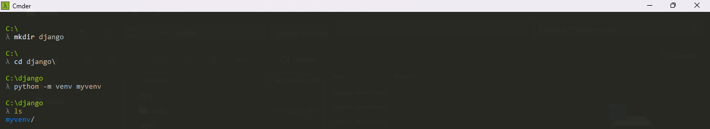

Haremos en virtualenv llamado myvenv. El comando general estará en el formato: python -m venv myvenv. Con ls nos muestra lo que tiene dentro.

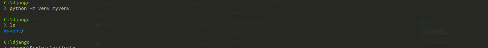

Activaremos el entorno virtual creado llamado myvenv : myvenv\Scripts\actívate
Para desactivar el entorno virtual creada  llamado myvenv : myvenv\Scripts\desactivate 
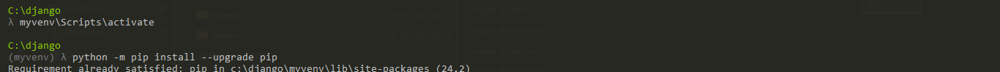

Sabrás que tienes virtualvenv iniciado cuando veas que la línea de comando en tu consola tiene el prefijo (myvenv). Antes de instalar Django debemos asegurarnos que tenemos la última versión de pip, el software que utilizamos para instalar el Django:
•	python -m pip
•	install --upgrade pip
Actualizado pip ahora se procedera hacer la instalación de django con el siguiente comando 
•	python -m pip install Django

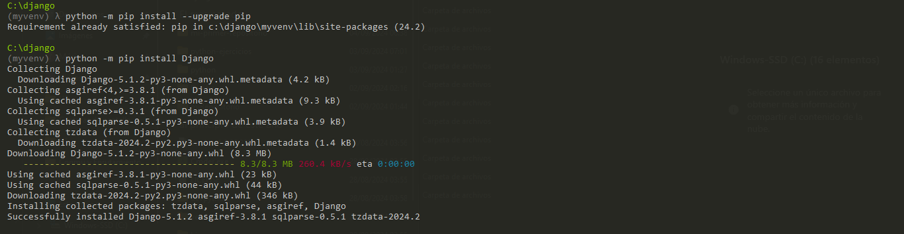

Crearemos nuestro primer proyecto en django :django-admin starproject mysite .

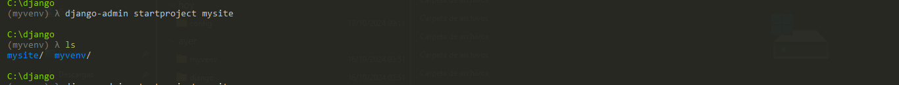

Para iniciar nuestra aplicación deben ejecutar el comando: python manage.py runserver 
Damos clic en el url que nos muestra y nos manda a la página de django.
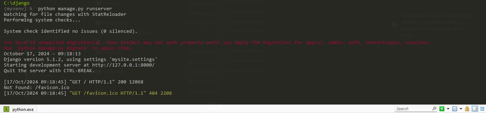

Debemos de ejecutar el comando: python manage.py migrate
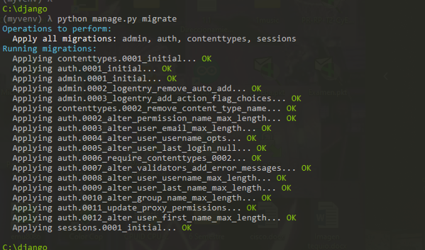

Deben ejecutar el comando: python manage.py createsuperuser para crear nombre de usuario, correo y contraseña(lauraosorio).
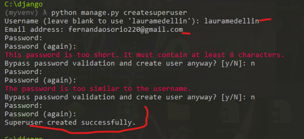

En la url tenemos que agregar /admin/
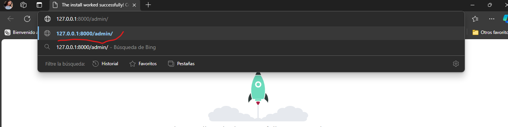

Volví a escribir el comando python manage.py runserver para que nos cargue la aplicación 
Ingresar usuario y contraseña y nos abre esta ventana
 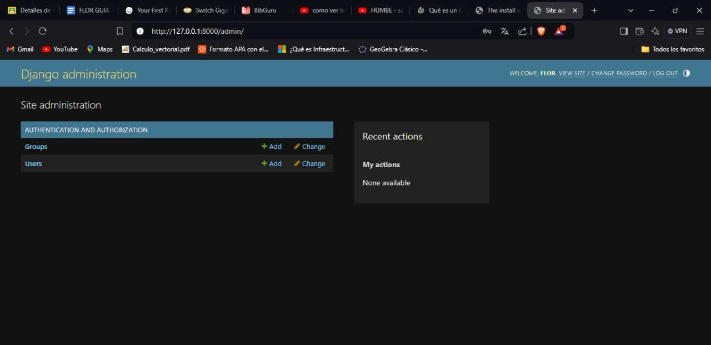
 
para salir, darle en desactivate y exit
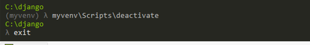
